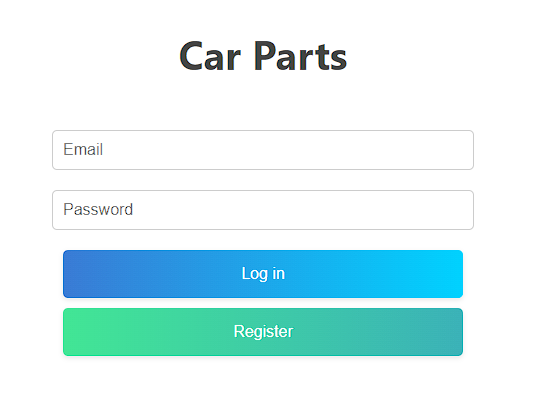
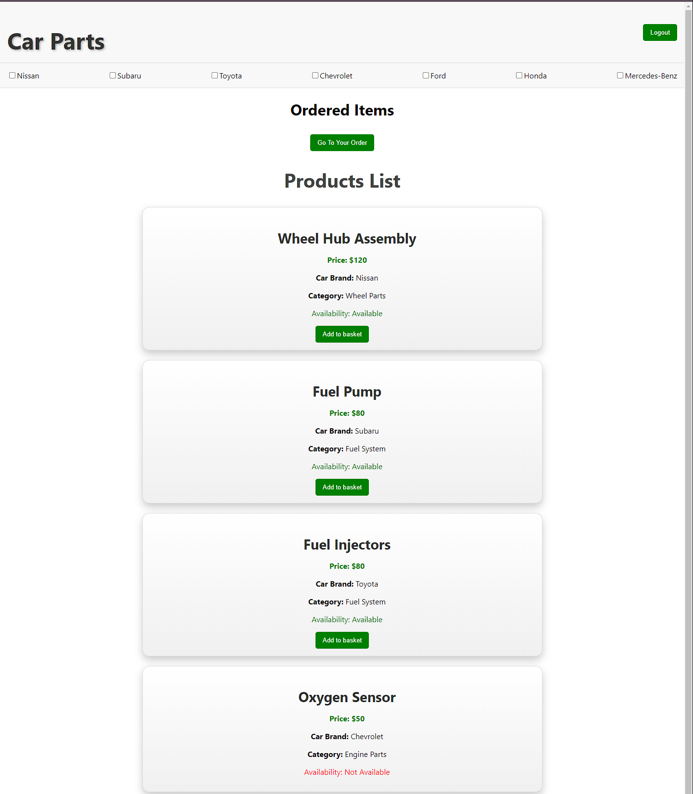
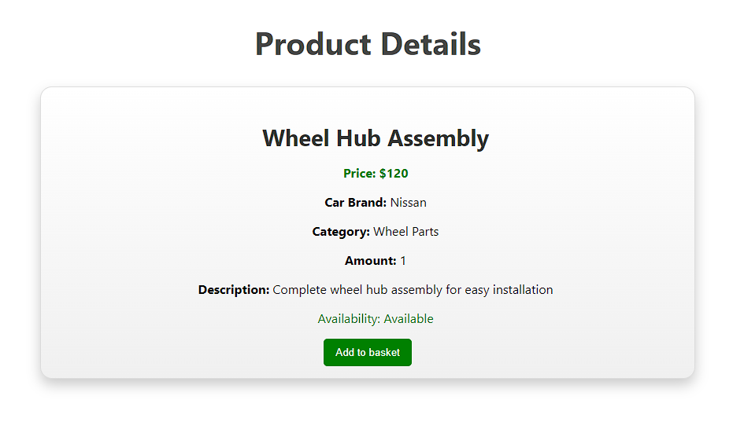
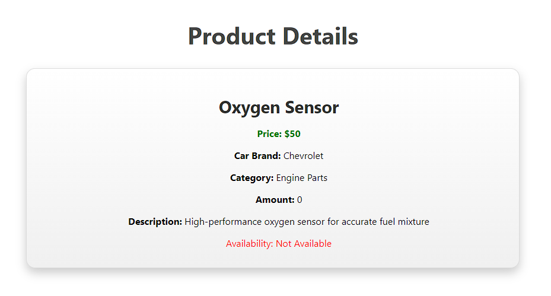
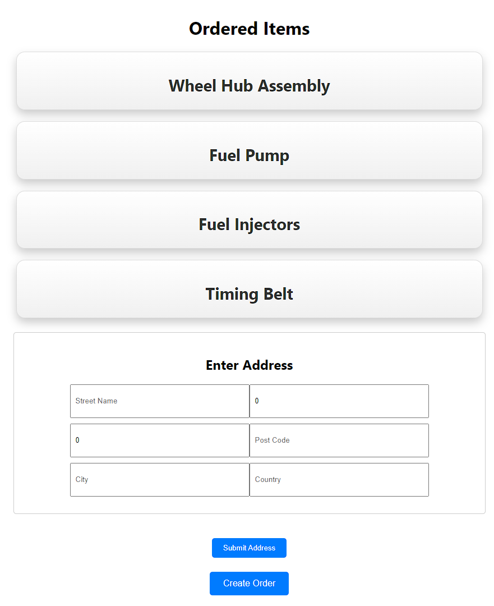
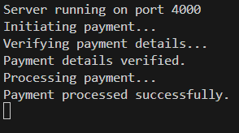
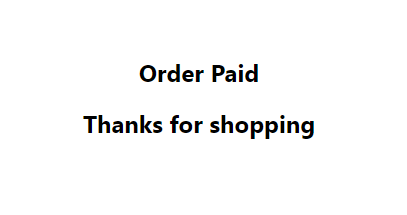

# Used Auto Parts Marketplace

This marketplace is developed using Node.js, MongoDB, and ReactJS, delivering a powerful platform with a range of functionalities to enhance user experience. Key features include:

Secure JWT User Authentication: Utilizes JSON Web Tokens (JWT) for robust and secure user authentication, ensuring data integrity and user privacy.

Comprehensive Product Management: Offers a comprehensive product management system, enabling sellers to easily list their auto parts with detailed information and images.

Seamless Payment Processing: Facilitates smooth and secure payment processing, providing users with a seamless checkout experience.

Efficient Address Handling: Implements efficient address handling mechanisms, allowing users to manage and store their shipping addresses securely.

Product Filtering: Introduces product filtering functionality, enabling users to refine search results based on specific criteria such as car brand, category, and availability.

Product Details: Provides detailed product information, allowing users to view specifications, availability, pricing, and descriptions before making a purchase.

This platform aims to revolutionize the way users buy and sell used auto parts, offering a seamless and secure online marketplace experience.

## Running Code

Running ServerApi
```bash
cd server
npm start
```
Running Client
```bash
cd client
npm start
```

## Screenshots
Login and Register



Main Page with Car Brand filter (will be more filters in future)



Product Details with available item in stock



Product Details with not available item in stock



Adding Address and Realizing Order



Payment Simulation



Payment Finish



```
